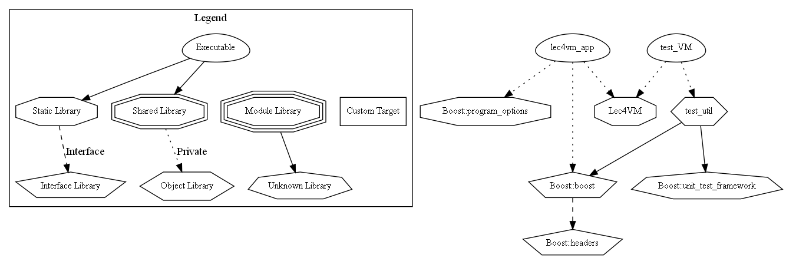

# 作业4虚拟机的C++实现

特性：

- [x] 运行时代码检查
- [x] 单步调试执行
- [x] 二进制代码转可读文本

# 构建说明

项目使用CMake组织：



## 构建

首先复制根目录中的`env.cmake.example`，重命名为`env.cmake`，然后根据本机环境配置其中的变量，之后执行cmake：

```
$ mkdir build
$ cd build
$ cmake --build .
```

## 打包

构建完成后使用cpack收集结果：

```
$ cpack -G ZIP
```

# 使用说明

## 应用

解释器命令行应用程序位于打包结果的`bin`目录中，使用`-h`选项查看帮助：

```
$ lec4vm
可用选项:
  -h [ --help ]         打印帮助信息
  -v [ --version ]      打印版本信息
  -d [ --debug ]        单步调试模式执行
  -p [ --print ]        只打印代码而不执行
  --source arg          指定程序源代码文件
```

解释执行结束时会打印虚拟机的格局：

```
$ lec4vm /code2 -d
===== STATE ====

> -451584234760 |

===== STACK ====
0  | 120
================
```

调试模式下每执行一条指令就打印虚拟机的格局，并且等待输入回车以继续执行：

```
$ lec4vm /code2 -d
===== STATE ====
0     Call     4 0
3     Exit
4     Cst      5
6     Call     5 1
9     Ret      *

> 0 |

===== STACK ====
================
```

## 库

打包结果中的`doc/html`为使用Doxygen提取源代码注释生成的文档。